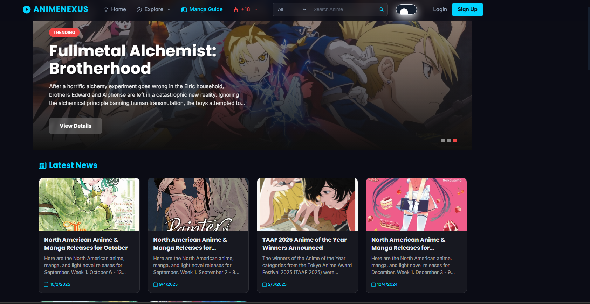
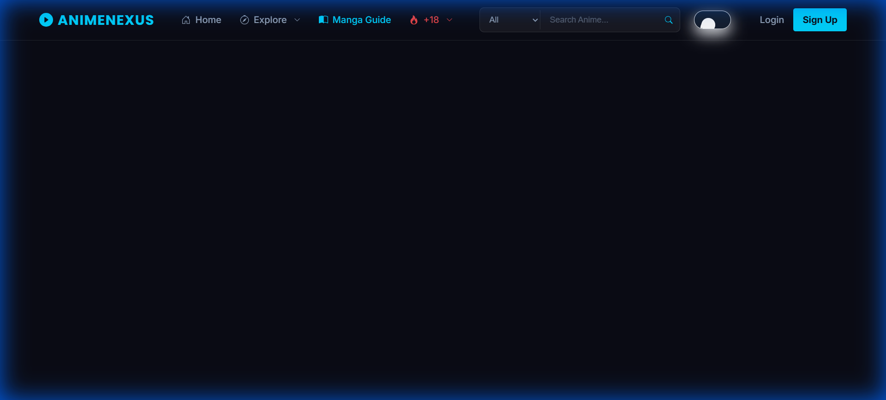
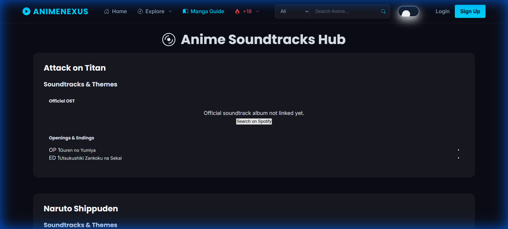
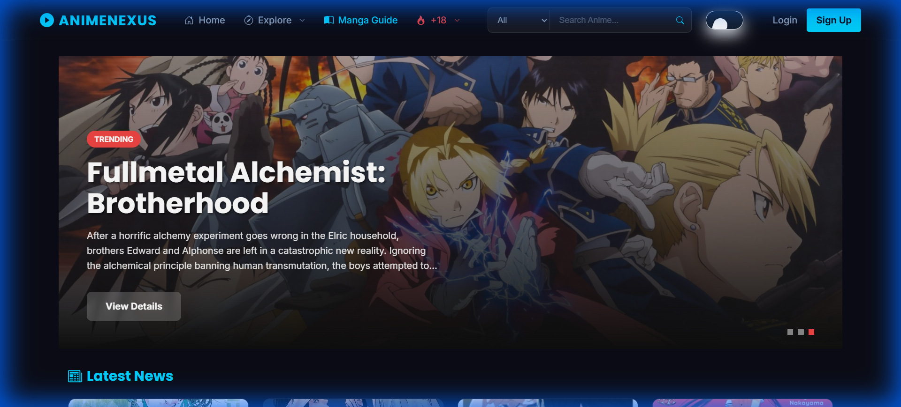
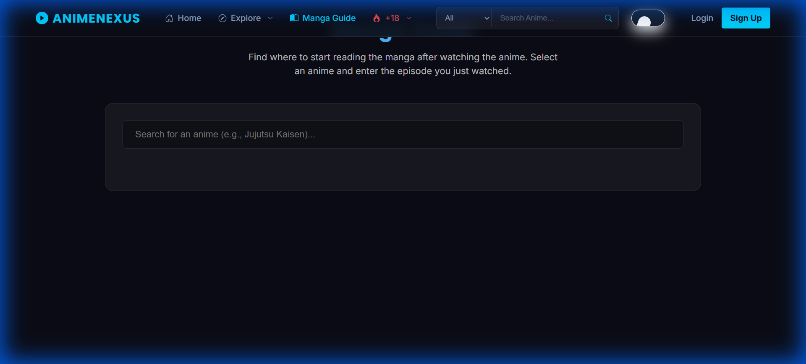

# AnimeNexus

[](https://reactjs.org/)
[](https://firebase.google.com/)
[](https://styled-components.com/)
[](https://animenexusapp.vercel.app/)



**Link to the page:** https://animenexusapp.vercel.app/

## About the Project
**AnimeNexus** is a modern, feature-rich web application designed for anime enthusiasts. It provides a comprehensive platform to discover movies, TV series, and explore detailed character information.

Built with performance and aesthetics in mind, it features a custom **Dark Mode**, **NSFW content gating**, and a seamless user experience powered by **React** and **Jikan API (MyAnimeList)**.

> [!NOTE]
> **Live Demo & Login:**
> To experience the full app (including profile and NSFW sections), you can register a new account or use the test credentials:
> - **Email:** `test@user.com` (or register your own)
> - **Password:** `123456`
> - **Deployment:** [Link to the page](https://animenexusapp.vercel.app/)

### Screenshots
> *Add your screenshots here*
>
> 
> *Interactive Hero Section & Trending Lists*

### Key Features Overview

| Feature | Description | Preview |
| :--- | :--- | :--- |
| **Mood Explorer** | Don't know what to watch? Tell us how you feel (Hype, Chill, Sad, etc.) and we'll recommend the perfect anime. |  |
| **Direct Soundtracks** | Listen to your favorite Openings & Endings directly. One-click YouTube search for instant gratification. |  |
| **NSFW Fanservice** | Age-Gated Content. Curated "Brutal Moments" and "Hot Characters" with video clips (not just images). |  |
| **Manga Guide** | Smart guide that tells you exactly where to start reading the manga after the anime ends. |  |

### Other Features
*   **Authentication:** Secure login and registration.
*   **Dark Mode:** Built-in theme toggler.
*   **Responsive:** Works perfectly on mobile.

### Tech Stack
*   **Frontend:** React.js (Hooks, Context API)
*   **Styling:** Styled Components (CSS-in-JS)
*   **Backend / Auth:** Firebase v9
*   **Data Source:** Jikan API v4 (MyAnimeList), AniList API
*   **Routing:** React Router v6
    ```

3.  **Configure Environment Variables**
    Create a `.env` file in the root directory and add your Firebase credentials:
    ```env
    REACT_APP_FIREBASE_API_KEY=your_api_key
    REACT_APP_FIREBASE_AUTH_DOMAIN=your_project.firebaseapp.com
    REACT_APP_FIREBASE_PROJECT_ID=your_project_id
    REACT_APP_FIREBASE_STORAGE_BUCKET=your_project.appspot.com
    REACT_APP_FIREBASE_MESSAGING_SENDER_ID=your_sender_id
    REACT_APP_FIREBASE_APP_ID=your_app_id
    ```

4.  **Start the development server**
    ```bash
    npm start
    ```
    Open [http://localhost:3000](http://localhost:3000) to view it in the browser.

---

<a name="español"></a>
## Sobre el Proyecto
**AnimeNexus** es una aplicación web moderna y completa diseñada para fanáticos del anime. Ofrece una plataforma para descubrir películas, series de TV y explorar información detallada sobre personajes.

Construida pensando en el rendimiento y la estética, cuenta con **Modo Oscuro** personalizado, **protección de contenido NSFW** y una experiencia de usuario fluida impulsada por **React** y la **Jikan API (MyAnimeList)**.

### Capturas de Pantalla


**Link to the page:** https://animenexusapp.vercel.app/

*Sección Hero Interactiva y Listas de Tendencias*

### Key Features Overview

| Feature | Description | Preview |
| :--- | :--- | :--- |
| **Mood Explorer** | Don't know what to watch? Tell us how you feel (Hype, Chill, Sad, etc.) and we'll recommend the perfect anime. |  |
| **Direct Soundtracks** | Listen to your favorite Openings & Endings directly. One-click YouTube search for instant gratification. |  |
| **NSFW Fanservice** | Age-Gated Content. Curated "Brutal Moments" and "Hot Characters" with video clips (not just images). |  |
| **Manga Guide** | Smart guide that tells you exactly where to start reading the manga after the anime ends. |  |

### Other Features
*   **Authentication:** Secure login and registration.
*   **Dark Mode:** Built-in theme toggler.
*   **Responsive:** Works perfectly on mobile.

### Tecnologías Usadas
*   **Frontend:** React.js (Hooks, Context API)
*   **Estilos:** Styled Components (CSS-in-JS)
*   **Backend / Auth:** Firebase v9
*   **Fuente de Datos:** Jikan API v4 (MyAnimeList), AniList API
*   **Enrutamiento:** React Router v6
*   **Iconos:** Iconify

### Cómo Correrlo Localmente

1.  **Clonar el repositorio**
    ```bash
    git clone https://github.com/tuusuario/animenexus.git
    cd animenexus
    ```

2.  **Instalar dependencias**
    ```bash
    npm install
    ```

3.  **Configurar Variables de Entorno**
    Crea un archivo `.env` en la raíz del proyecto y añade tus credenciales de Firebase:
    ```env
    REACT_APP_FIREBASE_API_KEY=tu_api_key
    REACT_APP_FIREBASE_AUTH_DOMAIN=tu_proyecto.firebaseapp.com
    REACT_APP_FIREBASE_PROJECT_ID=tu_proyecto_id
    REACT_APP_FIREBASE_STORAGE_BUCKET=tu_proyecto.appspot.com
    REACT_APP_FIREBASE_MESSAGING_SENDER_ID=tu_sender_id
    REACT_APP_FIREBASE_APP_ID=tu_app_id
    ```

4.  **Iniciar el servidor de desarrollo**
    ```bash
    npm start
    ```
    Abre [http://localhost:3000](http://localhost:3000) en tu navegador.
